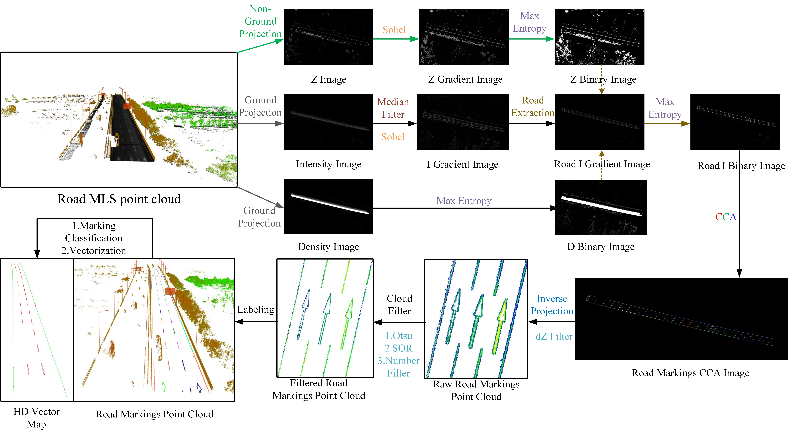
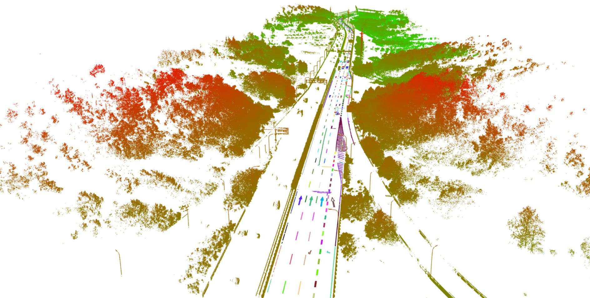
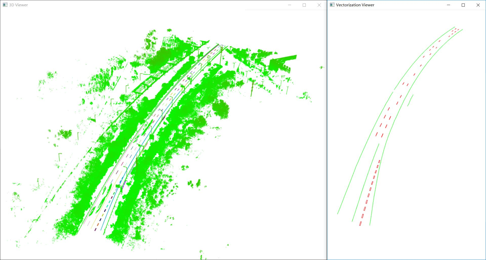
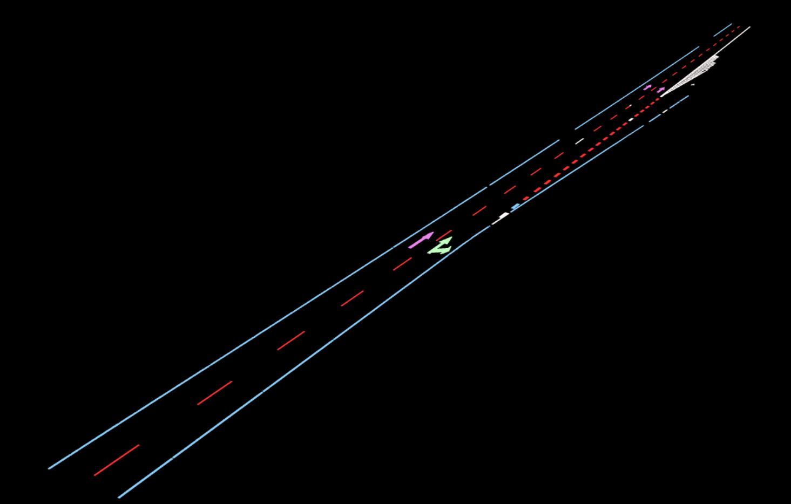
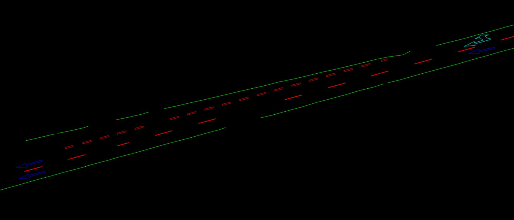
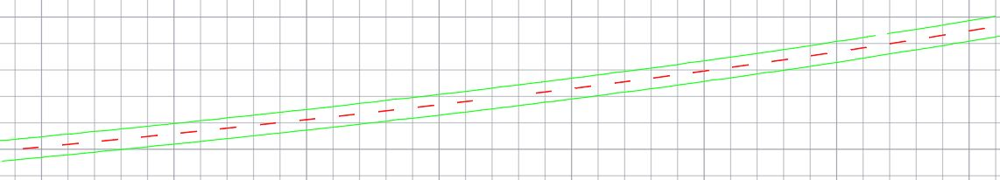

# RoadMarkingExtraction
A C++ Program for automatically extraction of road markings from MLS or ALS point cloud

### Under Development (V_1.0.1)

## About
Compile with VS2013 x64 Release or Debug

Dependent 3rd Party Libs:  PCL 1.8, OpenCV 2 , LibLas, DXFLib

Application Scenarios: MLS，ALS point cloud , Highway and City roads

Author：Yue Pan et al. @ WHU 

To contact the author, please email to panyue@whu.edu.cn

## How to use
1.Import a las file

2.Select datatype, roadtype and related information

3.Input the approximate point density ( number per m^2 )

4.Output all the classified road marking point clouds and the vectorization DXF file.

## Workflow
 

## Demo
 
 
 
 
 
 
 
 
 
