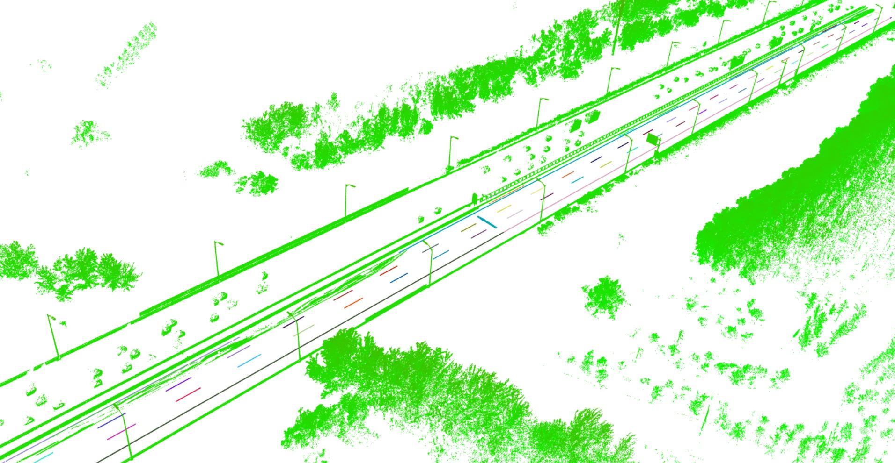
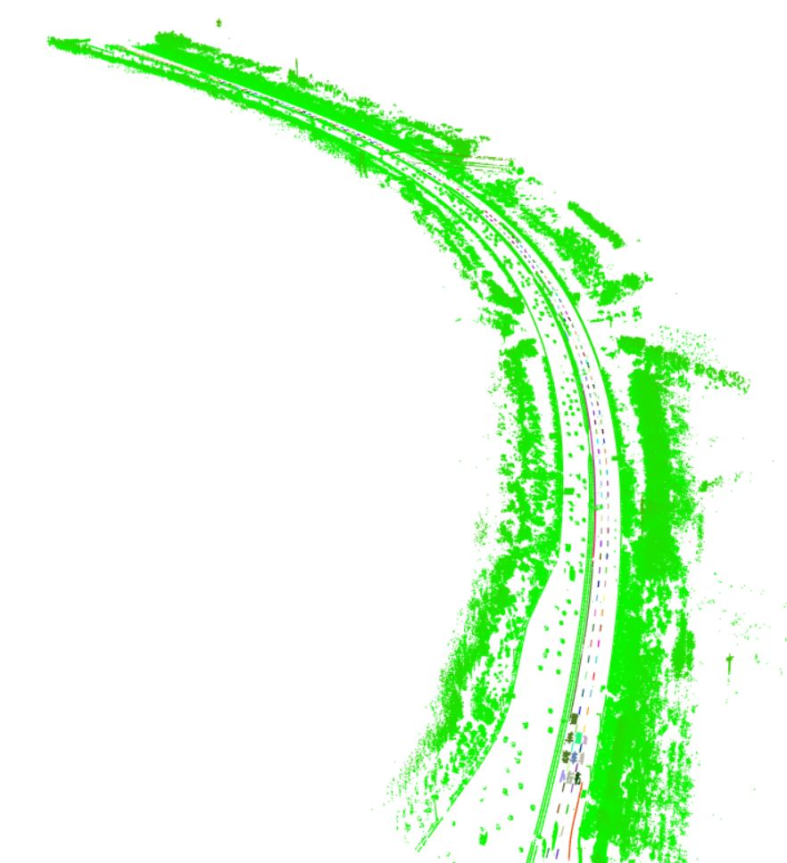
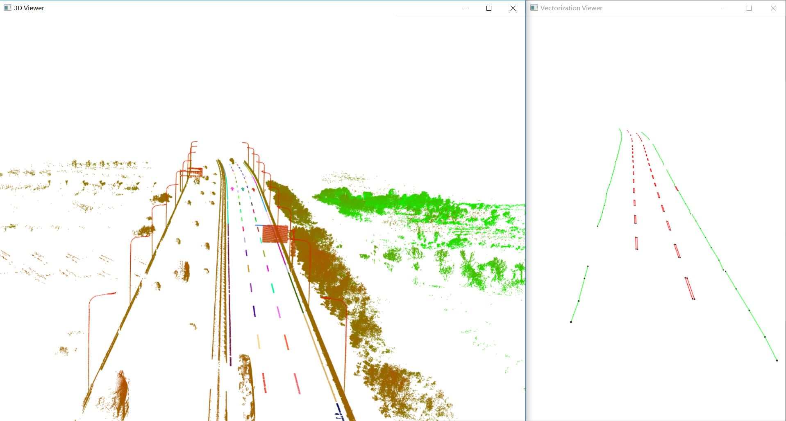

# RoadMarkingExtraction
A C++ Program for automatically extraction of road markings from MLS or ALS point cloud

### Under Development

## About
Compile with VS2013 x64 Release or Debug

Dependent 3rd Party Libs:  PCL 1.8, OpenCV 2 , LibLas

Application Scenarios: MLS，ALS

Author：Yue Pan et al. @ WHU

## How to use
1.Import a las file

2.Input the resolution for projected image (unit: meter)

## Workflow
 

## Demo
 
 
 
 
 
 
 
